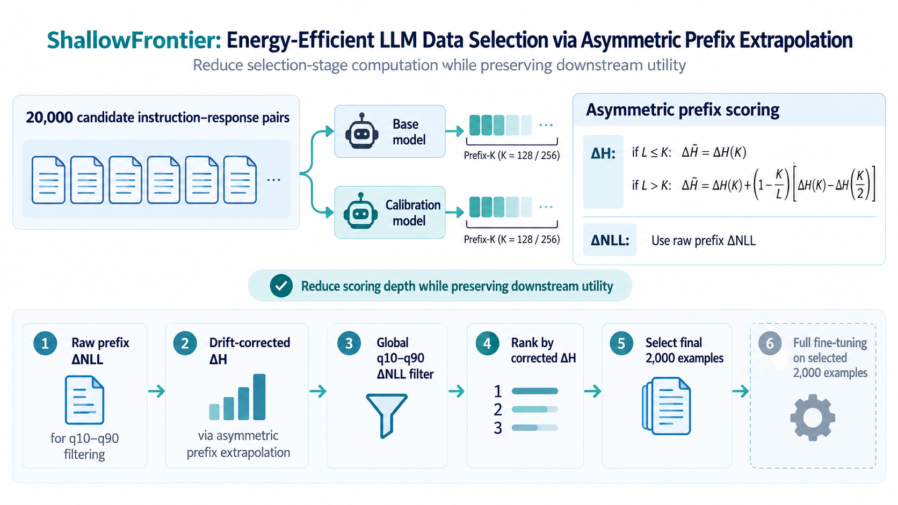
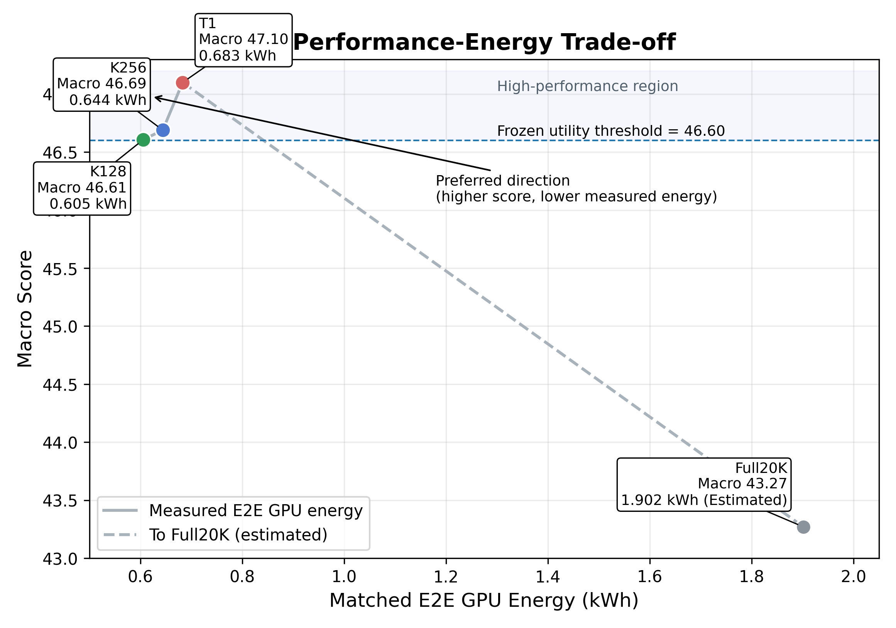
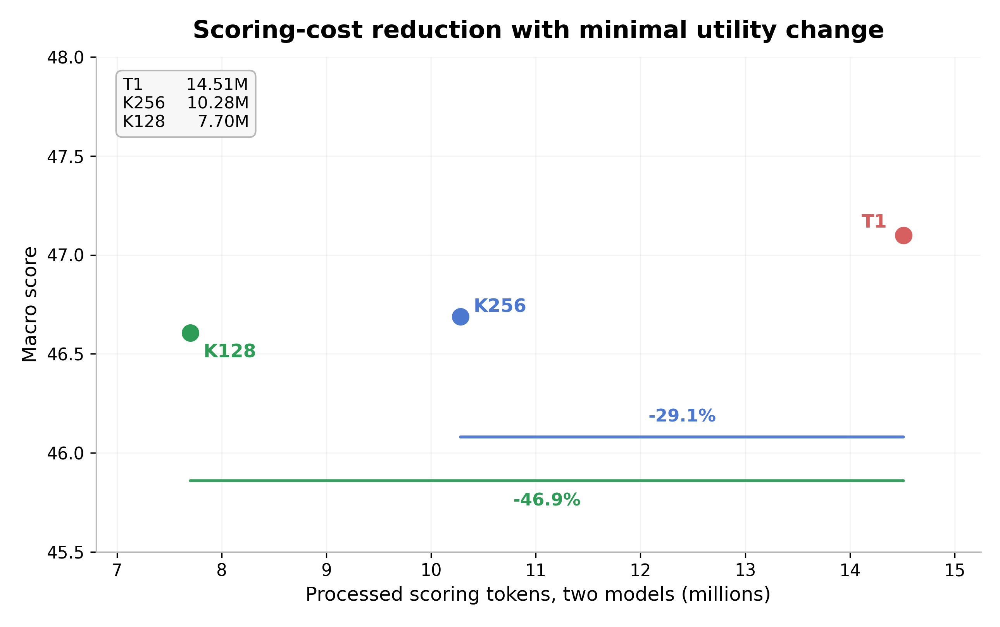
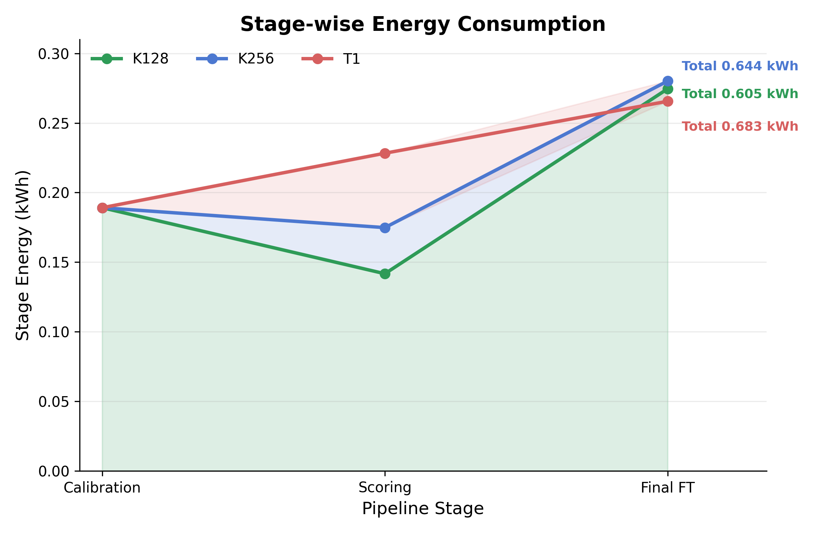
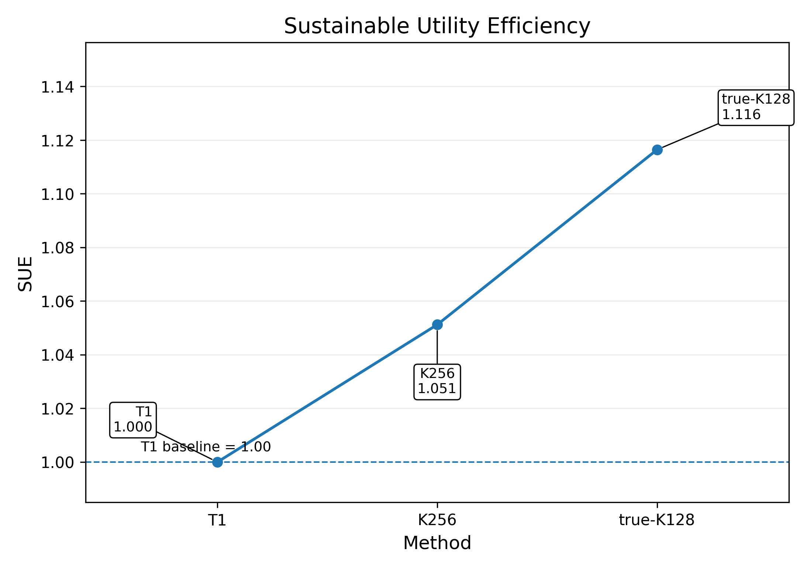
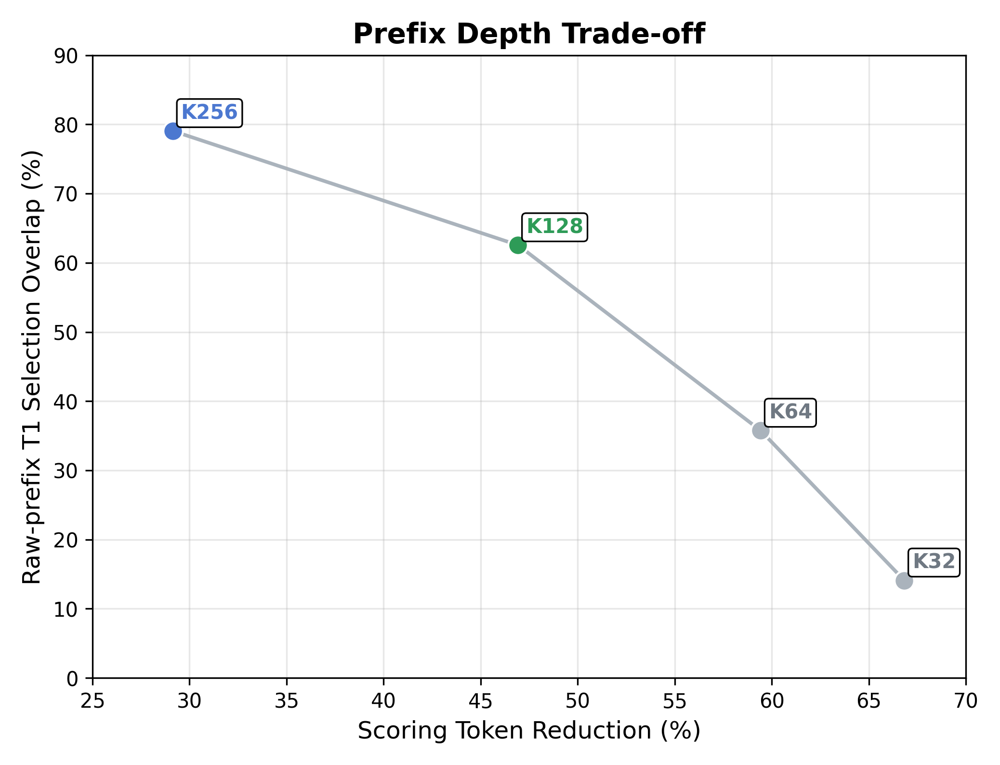
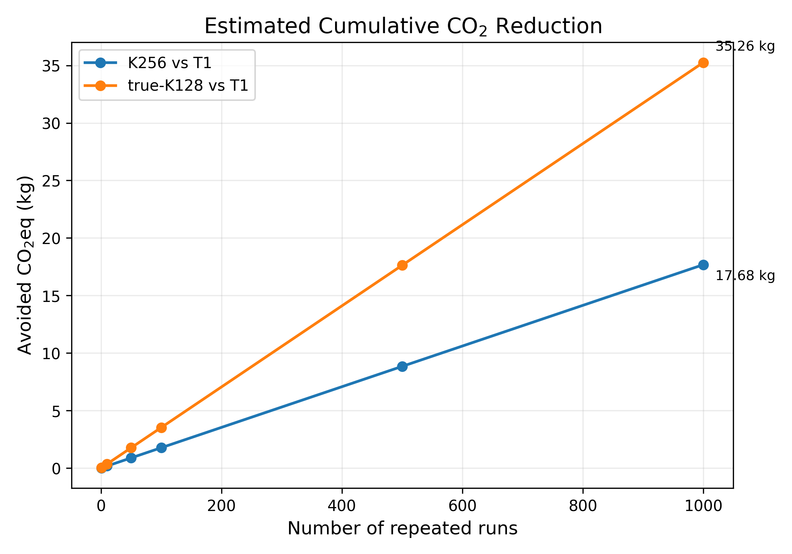

# ShallowFrontier

**Energy-Efficient LLM Data Selection via Asymmetric Prefix Extrapolation**

ShallowFrontier reduces the candidate-scoring cost of [InstructDiff](https://github.com/zhuchichi56/Instruct-diff) by evaluating response prefixes (K=128 or 256) and extrapolating the entropy difference used for data selection.

<p align="center">
  
</p>

## Results

Qwen2.5-7B, Math/Medical, 20K candidates, 2K selected examples, seed 42.

| Method | Math | Medical | Macro |
|---|---:|---:|---:|
| Base | 12.06 | 65.20 | 38.63 |
| Full20K | 29.17 | 57.37 | 43.27 |
| Random2K | 26.66 | 62.96 | 44.81 |
| InstructDiff T1 | 28.62 | 65.59 | **47.10** |
| InstructDiff T2 | 27.63 | 64.65 | 46.14 |
| InstructDiff T3 | 29.23 | 62.42 | 45.83 |
| ShallowFrontier K256 | 27.88 | 65.50 | **46.69** |
| ShallowFrontier K128 | 28.02 | 65.19 | **46.61** |

Full per-benchmark scores for all eight methods: [results/performance/](results/performance/).

| Method | Scoring tokens (base + calibration) | Token reduction vs. T1 | Measured E2E GPU energy | Energy reduction vs. T1 |
|---|---:|---:|---:|---:|
| T1 | 14,510,380 | — | 0.682982 kWh | — |
| K256 | 10,282,340 | **29.14%** | 0.644048 kWh | **5.70%** |
| K128 | 7,702,010 | **46.92%** | 0.605340 kWh | **11.37%** |

The prespecified operational utility tolerance is **47.10 - 0.50 = 46.60 Macro points**. Both configurations meet this threshold in the reported seed-42 run. This is not a statistical non-inferiority result.

**Matched E2E GPU energy versus downstream performance.** T1/K256/K128 are measured; Full20K is an estimate from a partial run.

<p align="center">
  
</p>

**Candidate-scoring tokens versus downstream performance.** Scoring tokens are not total training tokens.

<p align="center">
  
</p>

## Method

For response length `L` and prefix depth `K`, the asymmetric correction is applied to the entropy difference ΔH:

```text
ΔH_hat = ΔH_K                                if L <= K
ΔH_hat = ΔH_K + (1 - K/L)(ΔH_K - ΔH_K/2)    if L > K
```

Selection uses the original **raw ΔNLL q10–q90 filter**, followed by **corrected ΔH ranking** to select 2K examples. ΔNLL is not extrapolated in the proposed method.

| Correction | K128 T1 overlap | K256 T1 overlap |
|---|---:|---:|
| Raw prefix | 62.55% | 79.05% |
| NLL-only | 61.75% | 78.40% |
| **H-only (ShallowFrontier)** | **66.05%** | **81.40%** |
| Both | 65.10% | 80.85% |

These are selected-set overlaps, **not** downstream correction-ablation results.

## Reproduction

Run all commands below from the **repository root**.

**Environment (Python 3.10; separate training and evaluation environments):**

```bash
python -m pip install -r requirements-train.txt
python scripts/repro/check_environment.py --profile train --strict
```

For evaluation, activate a separate environment and run:

```bash
python -m pip install -r requirements-eval.txt
python scripts/repro/check_environment.py --profile eval --strict
```

Requirements are installation specifications, not a full historical dependency lock. Recorded package versions, hardware and training hyperparameters are in [Reproducibility](docs/reproducibility.md).

**Model:** Qwen2.5-7B, at `models/Qwen2.5-7B` by default. Override with `SHALLOWFRONTIER_BASE_MODEL`.

**Data:** The exact K128/K256 selected 2K sets are provided in `results/selections/`. Candidate scoring additionally requires the matching 20K pool and calibration model, which are not included; see [Data](data/README.md).

**Scoring and selection:** `scripts/scoring/prefix128_score.py`, `scripts/scoring/prefix256_score.py` and `scripts/selection/select_from_scores.py`.

**Final 2K full fine-tuning** (matched two-GPU configuration):

```bash
CUDA_VISIBLE_DEVICES=0,1 WORLD_SIZE=1 \
PYTORCH_CUDA_ALLOC_CONF=expandable_segments:True \
python scripts/training/train_k256_fullft.py
```

```bash
CUDA_VISIBLE_DEVICES=0,1 WORLD_SIZE=1 \
PYTORCH_CUDA_ALLOC_CONF=expandable_segments:True \
python scripts/training/train_k128_fullft.py
```

Leave `LOCAL_RANK`, `RANK`, `MASTER_ADDR` and `MASTER_PORT` unset.

**Downstream evaluation** (from the activated evaluation environment):

```bash
bash scripts/evaluation/eval_k256_official.sh
bash scripts/evaluation/eval_k128_official.sh
```

The Math average covers Math-OAI, Minerva Math, OlympiadBench, AIME24 and AMC23; the Medical average covers MedQA, MMLU Medical and MedMCQA. `Macro = (Math Average + Medical Average) / 2`.

**CPU tests:**

```bash
python -m pip install -r requirements-dev.txt
python -m pytest -q tests
```

## Energy and Sustainability

Matched E2E GPU energy sums **warmup calibration + candidate scoring + final 2K fine-tuning**, measured with 1 Hz NVML GPU counters. Official downstream evaluation, CPU, memory, storage and datacenter overhead are excluded. Primary results use gross GPU energy.

**QCCR (Quality-Constrained Carbon Reduction)** is the T1-relative operational carbon reduction among methods meeting the prespecified utility criterion, **Macro ≥ 46.60**:

```text
QCCR(m) = 100 × (1 - C_m / C_T1) %, if Macro(m) ≥ 46.60
C_m = gross E2E GPU energy(m) × grid carbon factor
```

Methods below the threshold do not qualify. Because the same grid factor is applied to each method, QCCR equals the percentage gross GPU-energy reduction: **5.70% (K256)** and **11.37% (K128)**.

**SUE (Sustainable Utility Efficiency)** normalizes the improvement over the untrained Base model by operational carbon cost, relative to T1:

```text
SUE(m) = [(Macro(m) - Macro(Base)) / (Macro(T1) - Macro(Base))]
         / [C_m / C_T1]
```

The figure uses the exact Base, T1, K256 and K128 Macro scores from [results/performance/](results/performance/) and measured E2E GPU energy from [results/cost/](results/cost/). **SUE(T1) = 1.00**. Both metrics are study-specific descriptive measures, not statistical tests.

<p align="center">
  
</p>

<p align="center">
  
</p>

<p align="center">
  
</p>

**Carbon scale-out is a modeled scenario**, not direct CO₂ measurement. The 2023 Korean consumption-end electricity factor is **0.4173 kgCO₂eq/kWh**, from the [official government announcement](https://mcee.go.kr/home/web/board/read.do?pagerOffset=530&maxPageItems=10&maxIndexPages=10&searchKey=&searchValue=&menuId=10598&orgCd=&boardMasterId=939&boardCategoryId=&boardId=1829260&decorator=). 

<p align="center">
  
</p>

The reported comparison uses **one training seed**. No multi-seed uncertainty or non-inferiority conclusion is available. The raw 1 Hz energy log and the exact raw-data-to-20K construction inputs are not distributed; complete end-to-end reconstruction therefore requires additional artifacts. See [Reproducibility](docs/reproducibility.md).

## License and Citation

ShallowFrontier builds on [InstructDiff](https://github.com/zhuchichi56/Instruct-diff). Original ShallowFrontier contributions are offered under the [MIT License](LICENSE); upstream code, evaluation components and datasets remain subject to their respective rights. See [NOTICE](NOTICE) and [third-party licensing](docs/licensing.md).

Please cite the [original InstructDiff work](https://github.com/zhuchichi56/Instruct-diff#citation) when using the upstream framework.
